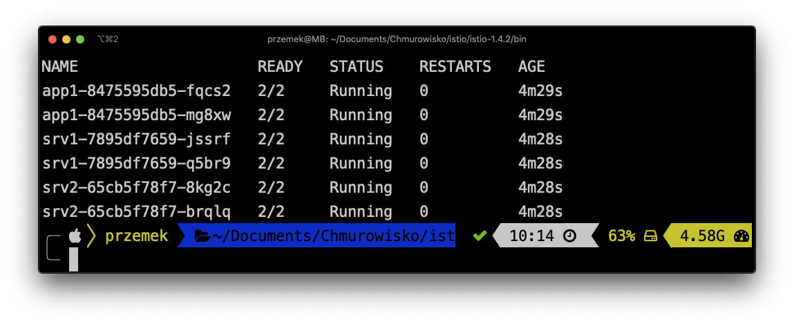

<br><br>
<br><br>
<br><br>

# Installing microservices

## LAB Overview

#### In this lab you will perform a deployment od microservices to the cluster


## Task 1: Creating a namespace for the deployment
1. Execute following command to create a namespace for the deployment
    
    ```bash
    kubectl create namespace srv
    ```

2. The default Istio installation uses automatic sidecar injection. Label the namespace that will host the application with istio-injection=enabled:
    
    ```bash
    kubectl label namespace srv istio-injection=enabled
    ```

## Task 2: Deploying the appliacaion
1. Download [a manifest file](files/k8s/deployments.yaml).
2. Deploy the file by executing:
    
    ```bash
    kubectl apply -f deployments.yaml
    ```
    
    Using the deployments file you created:
   * 3 service accounts
   * 3 devloyments
   * 3 virtual services
   * ingres for all services

## Task 3: Examinig the solution
1. Verify that all services are up and running by executong following command:
    
    ```bash
    kubectl get svc -n srv
    ```
    
    You should have 3 service running
    

2. Verify that istio proxy was injected to all the pods:
   
   ```bash
    kubectl get pods -n srv
    ```

    


3. Determine the ingress IP by executing the following command:
    
    ```bash
    kubectl get svc --all-namespaces
    ```

    and find the external IP for your ingress
    
    


4. Open any browser of your choice and open following urls:
   * ``<YOUR-INGRESS-IP>/app1``
   * ``<YOUR-INGRESS-IP>/srv1``
   * ``<YOUR-INGRESS-IP>/srv2``

    All pages should be accessible.

5. Using *bash* execute following command
    
    ```bash
    for  ((i=1;i<=100;i++)); do   curl  "<YOUR-INGRESS-IP>/app1"; done
    ```

6. Open *kiali* by executing:
    
    ```bash
    istioctl dashboard kiali
    ```

    and look into it.
7. Open Menu from the left and go to **Graph** section. Select the namespace **srv**.
8. Execute the following command once again and watch the animation :-)
    
    ```bash
    for  ((i=1;i<=100;i++)); do   curl  "<YOUR-INGRESS-IP>/app1"; done
    ```

9. Close the Kiali dashbaord and open *jaeger* dashboard by executing:
    
    ```bash
    istioctl dashboard jaeger
    ```

    Also you can run the following command:

    ```bash
    for  ((i=1;i<=100;i++)); do   curl  "<YOUR-INGRESS-IP>/app1"; done
    ```

10. Examine the traces in the UI (by selecting **app1.srv** from Service section)

## END LAB

<br><br>
<center><p>&copy; 2023 Chmurowisko Sp. z o.o.<p></center>
