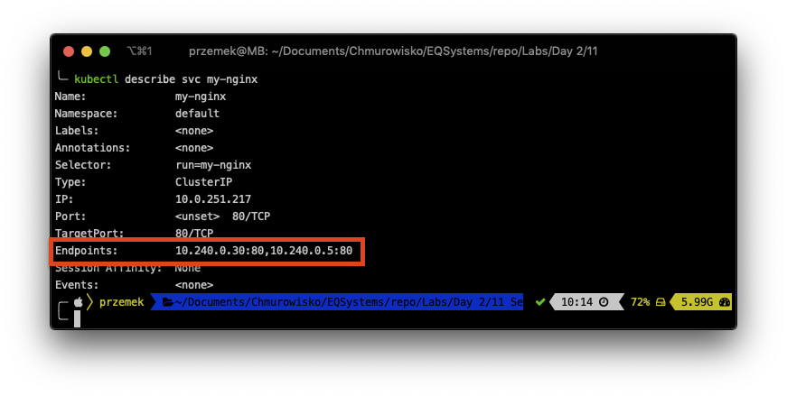
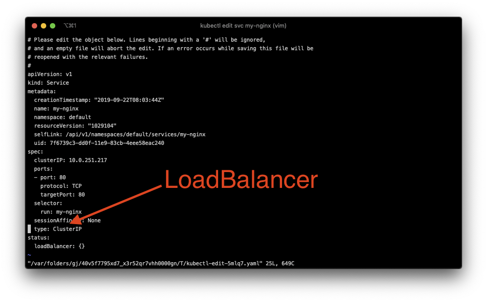
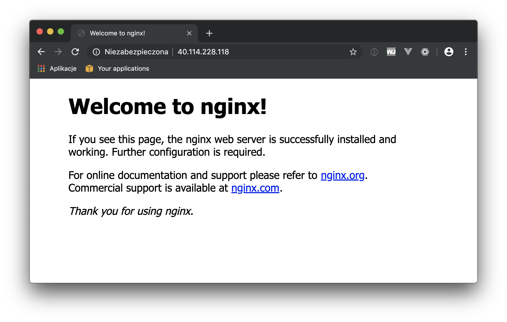
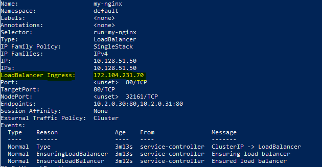
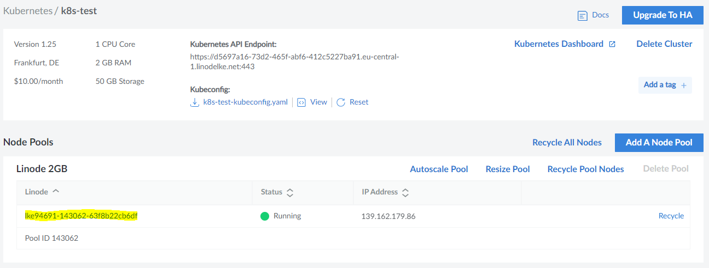

<br><br>
<br><br>
<br><br>

# Service

## LAB Overview
In this lab you will work with Services. An abstract way to expose an application running on a set of Pods as a network service.

## Task 1: Creating a Deployment
Create an nginx Pod, and note that it has a container port specification.
1. Open [manifest file](./files/depl.yaml) and check its contents
1. Type `kubectl apply -f depl.yaml` and press enter.
1. Get the list of running Pods with their IPs:

    ```bash
    kubectl get pods -l run=my-nginx -o wide
    ```
    
    

## Task 2: Creating Service

1. Create Service running following command:

    ```bash
    kubectl expose deployment my-nginx
    ```

    Instead, you can download [a manifest file](./files/service.yaml) and apply it using `kubectl apply -f service.yaml`.

    You created a Service which targets TCP port 80 on any Pod with the run: my-nginx label, and expose it on an abstracted Service port (targetPort: is the port the container accepts traffic on, port: is the abstracted Service port, which can be any port other pods use to access the Service)

1. Check the service: `kubectl get service my-nginx`

    

    A Service is backed by a group of Pods. These Pods are exposed through endpoints. The Service’s selector will be evaluated continuously and the results will be POSTed to an Endpoints object also named my-nginx

1. Check the endpoints, and note that the IPs are the same as the Pods created in the first step: `kubectl describe svc my-nginx `
    

## Task 3: Accessing the Service from within the cluster using DNS

1. Check if DNS is running on the clustert: `kubectl get services kube-dns --namespace=kube-system`
    
1. Use *kubectl run* to execute a container that provides the nslookup command from the dnsutils package:
    ```bash
    kubectl run curl --image=radial/busyboxplus:curl -i --tty --rm
    ```
1. Inside the container run: ``nslookup my-nginx``
    

1. Still inside the container try getting data from *my-nginx* service:
    `curl my-nginx.default.svc.cluster.local`
    

## Task 4: Exposing the Service

Kubernetes supports two ways of doing this: *NodePorts* and *LoadBalancers*. You'll create a load balancer.

1. Run `kubectl edit svc my-nginx` and set type to **LoadBalancer**. Save changes.
    
1. Run `kubectl get svc my-nginx -w` and wait for **EXTERNAL-IP**
    
1. Using any browser of your choice, navigate to **EXTERNAL-IP** address
    
    Your service is now exposed to the Internet on unique IP address. The IP address was reserved for you by Linode.
    

1. Describe the service: `kubectl describe service my-nginx`
    

    there, you also have your Load Balances Ingress IP.

## Step 5: Exposing another Service

1. Create apache2 deployment:

    ```bash
    kubectl apply -f depl2.yaml
    ```

1. Expose apache2 server using another Service of type Load Balancer:

    ```bash
    kubectl apply -f service2.yaml
    ```

1. Check if new service has different IP address
  
    ```bash
    kubectl get svc
    ```
   
    
  
2. Go to the Linode Cloud portal and in Node Balancers check if you can see new services.

    

3. To check the configuration of each Node Balancers click "Configurations" and expand it. In the Backend Nodes section you can see the Label of linked k8s.

    

4. To verify the label go to the kubernetes blade, choose the one that you work on and check the label.

    

5. Please, delete deployments and services that your created:
    ```bash
    kubectl delete service my-nginx
    ```
    ```bash
    kubectl delete service apache
    ```

    and deployment
    
    ```bash
    kubectl delete deployment my-nginx
    ```
    ```bash
    kubectl delete deployment apache
    ```
      
## END LAB

<br><br>

<center><p>&copy; 2023 Chmurowisko Sp. z o.o.<p></center>
